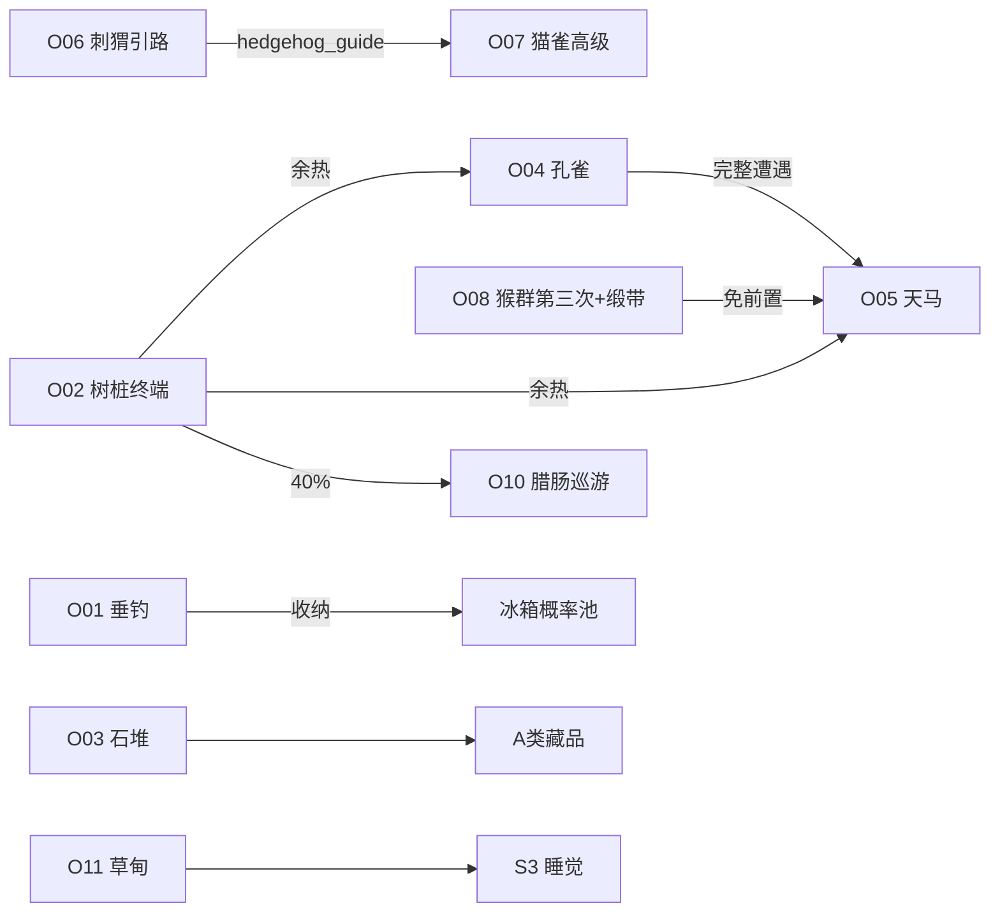

# 《404号房间》场景交互映射说明（开发者版）

## 1. 文档用途

本文档定义全部场景背景与可交互元素、浮层素材、业务规则的对应关系，供前端挂载热区、切换场景、弹出浮层时直接对照。

业务规则以 `PRD.MD` 为准；本文档说明「点哪里、经过几步、出现什么、调用哪条 PRD 规则」。

**v2.0 变更**：新增户外场景 `outdoor_forest`（`background_forest`），以 `images/scenes/zoo/` 动物素材为核心，采用**多步骤交互链**（非单次点击即结束）。

---

## 0. 核心展示原则（必读）

**主界面常态不挂载任何可交互元素贴图。**

| 允许常驻展示 | 不允许常驻展示 |
| --- | --- |
| 背景环境彩绘（含树桩/码头/栅栏等轮廓；林中绿色史莱姆状像素块视为背景装饰） | `interact/`、`element/`、`collectible/`、`scenes/zoo/` 独立贴图 |
| 桌宠小人 | 动物遭遇贴图、电脑浮层、可乐、家具、PLAY 标 |
| 全局 UI（余额、收藏柜、设置、场景 Tab） | 郊野图鉴动物持久叠加 |
| 状态反馈（思念气泡、表情，有时效） | 已解锁家具持久贴图 |
| 隐藏小猫（T1 解锁后跟随） | 藏品图标散落 |

**原则**：背景彩绘只负责「像是可以互动」；`scenes/zoo/` 动物与 `interact/` 道具**仅在 L4 浮层存活期展示**，关闭即销毁。

**户外林区特例**：浮层内进行中的多步交互（如垂钓读条、三连轻点引刺猬）未结束前，禁止点击其他热区；顶部显示细进度点（●○○）。

---

## 2. 背景资源

| 场景 ID | 背景资源名 | 场景名称 | 主题 |
| --- | --- | --- | --- |
| `room_working` | `background_working` | 办公区 | 双工位、电脑、书架、墙面装饰 |
| `room_living` | `background_living` | 生活区 | 床、冰箱、街机、垃圾桶、中央空地 |
| `outdoor_forest` | `background_forest` | 数据林海 | 六边形木框生态园：绿/橙圆冠树、栅栏、树桩、花圃、池塘码头 |

室内两图共用建筑壳：左白墙、右浅蓝墙、橙横纹木地板、右墙窗户。  
户外图：**等距像素风一致**，但为六边形木框野外构图，天空淡青，地面青草与褐色翻耕带，下方池塘+木栈道。

---

## 3. 场景分工总览

### 3.1 室内（PRD 固定交互 + 家具）

| 交互类型 | 办公区 | 生活区 |
| --- | --- | --- |
| 电脑 | ✅ | — |
| 床 | — | ✅ |
| 冰箱 | — | ✅ |
| 垃圾桶 | — | ✅ |
| 街机 | — | ✅ |
| F01—F05 家具 | W03/W05/W06 | L02/L03 |
| 桌宠 / 小猫 / 全局 UI | ✅ | ✅ |

### 3.2 户外林区（动物生态链，见 §8）

| 类型 | 说明 |
| --- | --- |
| PRD 映射 | 树桩→电脑；花圃空地→床；池塘→冰箱；石堆→垃圾桶；**无街机**（林海不挂载赛博跳跃入口） |
| 动物遭遇 | 15 个 `scenes/zoo/` 素材全部可遭遇，分布在 7 条交互链 |
| 郊野图鉴 | 本地记录已遭遇动物；**不改变主界面画面** |
| 串联机制 | 刺猬引路 → 花丛猫雀；猴群递进 → 天马；树桩余热 → 孔雀/天马概率加成 |

---

## 4. 场景切换规则

| 项目 | 规则 |
| --- | --- |
| Tab | 底部「办公区 / 生活区 / 数据林海」三 Tab，当前高亮 |
| 默认 | 首次进入默认办公区 |
| 动画 | 0.3 秒横向滑动；桌宠移至目标场景默认站立点 |
| 状态保留 | 切换不重置桌宠状态、Buff、进行中的多步链进度**写入会话内存**，切回林海可续接未超时步骤 |
| 办公区站立点 | 两工位间地板中央 |
| 生活区站立点 | 床与街机间地毯区上方 |
| 林海站立点 | 栅栏前方中央青草空地（翻耕带上方） |

**防抖**：Tab、收藏柜、设置 0.5 秒内只响应第 1 次点击。

---

## 5. 图层结构

| 层级 | 名称 | 内容 |
| --- | --- | --- |
| L0 | 背景层 | `background_working` / `background_living` / `background_forest` |
| L1 | 角色层 | 桌宠、隐藏小猫 |
| L2 | 热区层 | 透明可点击区 |
| L3 | UI 层 | 余额、Tab、收藏柜、设置；林海额外「郊野图鉴」入口（右下偏上，与收藏柜错开） |
| L4 | 浮层层 | 弹窗、多步交互面板、动物遭遇、气泡 |

不存在家具/动物常驻层。

---

## 6. 办公区（`background_working`）

### 6.1 热区清单

坐标：背景图百分比（原点左上）。

| 热区 ID | 区域名称 | 参考坐标 (x%, y%, w%, h%) | 行为 | PRD |
| --- | --- | --- | --- | --- |
| `W01` | 左工位电脑 | 8, 38, 22, 18 | §6.2 | 3.3.1 |
| `W02` | 右工位电脑 | 58, 38, 22, 18 | §6.2 | 3.3.1 |
| `W03` | 左工位桌面 | 10, 48, 18, 8 | §6.3 | 3.5 F01 |
| `W04` | 右工位桌面 | 60, 48, 18, 8 | §6.3 | — |
| `W05` | 角落书架 | 42, 28, 16, 30 | §6.4 | 3.5 F05 |
| `W06` | 左墙公告板 | 6, 12, 14, 22 | §6.5 | 3.5 F04 |
| `W07` | 左下绿植 | 2, 62, 10, 18 | 装饰气泡：「它也在等您回来。」 | — |

### 6.2 电脑（W01 / W02）

1. 点击 → L4 `interact/computer`（午夜 `computer_simple`）
2. 桌宠 S2；屏幕每秒掉落 0/1
3. 关闭时 3% C013

### 6.3 桌面（W03 / W04）

F01 未解锁 → 解锁面板 15 碎片；已解锁 → 咖啡杯特写浮层。W04 仅文字气泡。

### 6.4 书架（W05）

F05 未解锁 → 解锁面板；已解锁 → 杂物特写浮层。

### 6.5 墙面（W06）

F04 未解锁 → 解锁面板；已解锁 → 霓虹贴纸特写浮层。

---

## 7. 生活区（`background_living`）

### 7.1 热区清单

| 热区 ID | 区域名称 | 参考坐标 (x%, y%, w%, h%) | 行为 | PRD |
| --- | --- | --- | --- | --- |
| `L01` | 单人床 | 6, 36, 28, 22 | §7.2 | 3.3.2 |
| `L02` | 床头柜 | 32, 42, 8, 10 | §7.3 | 3.5 F02 |
| `L03` | 中央地毯 | 38, 58, 24, 16 | §7.4 | 3.5 F03 |
| `L04` | 冰箱 | 72, 34, 14, 28 | §7.5 | 3.3.3 |
| `L05` | 街机 | 54, 30, 16, 26 | §7.6 | 3.4 |
| `L06` | 垃圾桶 | 18, 58, 10, 14 | §7.7 | 3.3.4 |
| `L07` | 右墙窗户 | 78, 8, 16, 18 | 气泡：「外面是数据海，今天没有风。」 | — |
| `L08` | 左下绿植 | 2, 62, 10, 18 | 气泡：「它也在等您回来。」 | — |

### 7.2 床（L01）

点击 → 可选 0.5 秒特写 → S3 五分钟，清 Buff。T3 思念规则同 PRD。

### 7.3 床头柜（L02）

F02 解锁链：未解锁面板 / 已解锁夜灯亮起浮层。

### 7.4 地毯（L03）

F03 解锁链：未解锁面板 / 已解锁地毯特写。

### 7.5 冰箱（L04）

开门浮层 → PRD 概率池（赛博可乐 / 过期 / 空）。周末加成同 PRD。

### 7.6 街机（L05）

点击 → 赛博跳跃全屏；退出回到生活区。

### 7.7 垃圾桶（L06）

翻找浮层；每日 3 次；A 类藏品；20% S5。

---

## 8. 数据林海（`background_forest`）— 动物多步交互

### 8.0 背景分区对照（与 `background_forest.png` 对齐）

```
        [绿冠树群 O04]     [橙冠树群 O05/O08]
              \               /
         [告示碑 O09]   [猴林 O08]
    [花丛 O07] — [栅栏 O06] — [树桩 O02]
              \      |      /
           [中央空地·桌宠站位]
         [翻耕土带]    [石堆 O03]
              \      /
           [木栈道码头 O01]
              [池塘]
```

背景中的绿色史莱姆状小点、蝴蝶、蘑菇为**环境彩绘**，不可单独点击；动物一律用 `scenes/zoo/` 在浮层中展示。

### 8.1 热区清单

| 热区 ID | 区域名称 | 参考坐标 (x%, y%, w%, h%) | 交互链 | 关联素材 |
| --- | --- | --- | --- | --- |
| `O01` | 木栈道码头 | 38, 78, 24, 14 | §8.2 潜流垂钓 | `thing_iseebi_01` |
| `O02` | 年轮树桩 | 44, 48, 12, 10 | §8.3 终端启动 | `interact/computer` |
| `O03` | 石堆翻耕带 | 52, 62, 16, 12 | §8.4 石堆翻找 | A 类藏品 |
| `O04` | 左侧绿冠树群 | 8, 22, 22, 28 | §8.5 孔雀开屏 | `thing_peacock_01~04` |
| `O05` | 右上橙冠树 | 68, 18, 20, 26 | §8.6 天马栖枝 | `thing_whitepegasus_01` / `thing_pinkpegasus_01` |
| `O06` | 木栅栏 | 36, 42, 28, 10 | §8.7 刺猬引路 | `thing_hedgehog` |
| `O07` | 花丛 | 18, 52, 16, 14 | §8.8 猫雀同栖 | `thing_cats_13` / `thing_shimaenaga` |
| `O08` | 橙冠密林 | 72, 32, 18, 22 | §8.9 猴群递进 | `thing_monkey_01~03` |
| `O09` | 告示碑 | 58, 8, 10, 14 | §8.10 图鉴碑 | — |
| `O10` | 中央空地 | 40, 54, 20, 12 | §8.11 腊肠巡游 | `thing_dachshund_01` / `thing_dachshund_02` |
| `O11` | 花圃休憩 | 42, 56, 18, 10 | §8.12 草甸小憩 | 床 PRD 映射 |

> **坐标说明**：六边形画幅内取值；木框外空白区域不挂载热区。

### 8.2 交互链 O01 · 潜流垂钓

**映射**：冰箱补给语义（冷却液来自水底）  
**素材**：`scenes/zoo/thing_iseebi_01.png`

| 步 | 用户操作 | 系统反馈 | 超时 |
| --- | --- | --- | --- |
| 1 | 点击 O01 | 浮层：池塘+栈道；按钮「抛饵」 | — |
| 2 | 点「抛饵」 | 3 秒读条，水面涟漪像素动画；禁点其他热区 | 30 秒无操作回步 1 |
| 3 | 读条满 | 龙虾升起；文案：「钳子里夹着半行未提交的代码。」 | — |
| 4a | 点「收纳」 | 写入郊野图鉴「缓存龙虾」；按 PRD 冰箱概率结算一次（可乐/过期/空，文案换皮为泉水版） | — |
| 4b | 点「掷回」 | 龙虾下沉；50% 气泡「它回到底层线程去了。」/ 50% 再播步骤 2 可再来一轮（每自然日最多 2 轮） | — |

**同日再次进入 O01 且已完成 4a**：仅气泡「水流恢复平静。」

### 8.3 交互链 O02 · 年轮终端

**映射**：电脑 PRD（S2、0/1 掉落、3% C013）

| 步 | 用户操作 | 系统反馈 |
| --- | --- | --- |
| 1 | 点击 O02 | 浮层：树桩截面，裂纹微光；提示「再点裂纹」 |
| 2 | 2 秒内再点裂纹区域 | 裂纹扩大，露出迷你显示器框 |
| 3 | 长按显示器 1 秒 **或** 第三步点击 | 载入 `interact/computer`；桌宠 S2；0/1 掉落 |
| 4 | 关闭浮层 | 3% C013；树桩标记「余热」30 分钟（`stump_warm=true`） |

**余热加成**：`stump_warm` 期间，O04 步 2 成功率和 O05 步 1 触发率 ×1.5。

### 8.4 交互链 O03 · 石堆翻找

**映射**：垃圾桶 PRD（每日 3 次、A 类、20% S5）

| 步 | 用户操作 | 系统反馈 |
| --- | --- | --- |
| 1 | 点击 O03 | 浮层：石堆+翻耕土；按钮「拨开」 |
| 2 | 连点「拨开」3 次（每次间隔 <1.5 秒） | 每点尘土像素上扬；第三次露出缺口 |
| 3 | 自动 | 按 PRD 垃圾桶结算；成功展示藏品图标；失败 20% S5 |
| 4 | 点遮罩关闭 | 浮层销毁 |

超出每日 3 次：步骤 1 直接气泡「只剩电子灰尘了。」

### 8.5 交互链 O04 · 孔雀开屏（多形态）

**素材**：`thing_peacock_01` → `_02` → `_03` → `_04` 递进展示

| 步 | 用户操作 | 系统反馈 |
| --- | --- | --- |
| 1 | 点击 O04 | 浮层：绿冠树影；树冠抖动 |
| 2 | 5 秒内再点树冠 | 落下 `thing_peacock_01`；文案「它从缓存里借了三根羽毛。」 |
| 3 | 点击孔雀 | 切换为 `thing_peacock_02`（侧身） |
| 4 | 2 秒内连点孔雀 3 次 | 开屏：`thing_peacock_03` 或 `_04` 随机；写入图鉴 |
| 5 | 开屏后点「目送」 | 孔雀化为像素羽屑；当日 O04 冷却 |

**未开屏就关闭浮层**：图鉴记「偶遇」，不计入完整遭遇。

### 8.6 交互链 O06 · 天马栖枝

**前置**：郊野图鉴已记录孔雀完整遭遇 **或** `stump_warm=true`  
**素材**：平日 `thing_whitepegasus_01`；周六日 `thing_pinkpegasus_01`

| 步 | 用户操作 | 系统反馈 |
| --- | --- | --- |
| 0 | 不满足前置 | 气泡「树冠里只有风，没有权限。」 |
| 1 | 点击 O05 | 浮层：橙冠树顶星空像素 |
| 2 | 按住树冠 2 秒 | 流星划过（`town_shootingstar_01` 可叠加装饰） |
| 3 | 松手 | 天马降落；周末换粉色版 |
| 4 | 选择「跟随」或「目送」 | 跟随：本 session 桌宠移速 ×1.15 持续 3 分钟；目送：图鉴记录 |

### 8.7 交互链 O06 · 刺猬引路

**素材**：`thing_hedgehog.png`  
**串联**：完成后激活 O07 高级模式

| 步 | 用户操作 | 系统反馈 |
| --- | --- | --- |
| 1 | 点击 O06 | 浮层：栅栏缺口；桌宠自动移至栅栏左侧 |
| 2 | 按节奏轻点地面 3 次（系统显示 ●●○ 指示） | 前两次脚印；第三次 `thing_hedgehog` 滚出 |
| 3 | 点击刺猬 | 刺猬沿浮层内向右滚动，指向花丛方向 |
| 4 | 点「跟上」 | 关闭浮层；标记 `hedgehog_guide=true`（当日有效） |

**误触**：步骤 2 超过 2 秒未点 → 刺猬缩回，回步骤 1。

### 8.8 交互链 O07 · 猫雀同栖

**素材**：`thing_cats_13.png`、`thing_shimaenaga.png`

| 模式 | 条件 | 流程 |
| --- | --- | --- |
| 基础 | 默认 | ①点 O07 → 花丛特写 ②点花瓣 → 白猫探头 `cats_13` ③点猫 → 猫缩回，图鉴「偶遇」 |
| 高级 | `hedgehog_guide=true` | ①~②同基础 ③点猫 → 猫跃向树桩方向 ④1.5 秒内点树桩影 → `shimaenaga` 降落 ⑤两者并置 2 秒后飞走，图鉴双记录 |

高级模式每自然日 1 次。

### 8.9 交互链 O08 · 猴群递进

**素材**：`thing_monkey_01` → `thing_monkey_02` → `thing_monkey_03`（三日递进，可同日加速）

| 步 | 用户操作 | 系统反馈 |
| --- | --- | --- |
| 1 | 点击 O08 | 浮层：橙冠密林；空枝摇曳 |
| 2 | 从浮层底栏选「野果 / 树枝 / 缎带」三选一 | 选择写入 `monkey_bait` |
| 3 | 等待 2 秒 | 根据累计访问次数出猴：第 1 次 `_01`、第 2 次 `_02`、第 3 次 `_03` |
| 4 | 与猴互动 | 点猴 5 次 → 猴赠「猴群信物」气泡（无经济）；第三次 `_03` 且选「缎带」→ 当日 O05 免前置 |

**访问计数**：`monkey_visit_count` 持久化，满 3 后重置并图鉴集齐「猴群」徽章。

### 8.10 交互链 O09 · 图鉴碑

无动物贴图常驻；多步查看进度。

| 步 | 操作 | 反馈 |
| --- | --- | --- |
| 1 | 点击 O09 | 浮层：石碑，显示已遭遇动物数 / 15 |
| 2 | 点石碑 | 展开列表（仅文字+剪影，不展示 zoo 大图） |
| 3 | 集齐 15 | 第四次点击触发气泡：「林子里每一只像素都在等你回来。」+ 一次性 5 碎片 |

### 8.11 交互链 O10 · 腊肠巡游（被动多步）

**素材**：`thing_dachshund_01`、`thing_dachshund_02`  
**触发**：非点击启动；完成 O02 关闭浮层后 40% 概率自动进入。

| 步 | 系统行为 |
| --- | --- |
| 1 | 桌宠站立点出现爪印箭头（L4 非模态提示） |
| 2 | 用户 5 秒内点击 O10 | 浮层：腊肠从左入画 `dachshund_02` |
| 3 | 点击腊肠 | 切换 `dachshund_01` 对桌宠「吠」气泡 |
| 4 | 再点腊肠 | 腊肠跑向 O06 栅栏方向并消失；图鉴记录 |

未在 5 秒内点 O10：事件取消，当日不再触发。

### 8.12 交互链 O11 · 草甸小憩

**映射**：床 PRD（S3 五分钟、清 Buff、T3 思念）

| 步 | 用户操作 | 系统反馈 |
| --- | --- | --- |
| 1 | 点击 O11 | 浮层：花圃草地；「铺开餐布」按钮 |
| 2 | 点「铺开餐布」 | 0.8 秒铺布动画 |
| 3 | 点「躺下」 | 桌宠 S3；可跳过特写直接入睡 |
| 4 | 思念 T3 | 桌宠移至 O11；热区禁用；连点桌宠 3 次解除 |

---

## 9. 郊野图鉴（林海专用数据）

| 字段 | 说明 |
| --- | --- |
| 存储 | `localStorage.forest_bestiary` |
| 记录内容 | 动物 ID、遭遇等级（偶遇 / 完整）、首次日期 |
| 与收藏柜关系 | **独立系统**；动物不占用 C001—C015 格子 |
| UI | `UI_BESTIARY` 按钮，林海场景显示；其他场景隐藏 |

### 9.1 动物素材完整映射表

| 动物 ID | 文件名 | 触发链 | 完整遭遇条件 |
| --- | --- | --- | --- |
| Z01 | `thing_iseebi_01` | O01 步骤 4a 收纳 | 完成 PRD 冰箱结算 |
| Z02 | `thing_peacock_01` | O04 步骤 2 | 见到即记偶遇 |
| Z03 | `thing_peacock_02` | O04 步骤 3 | 同上 |
| Z04 | `thing_peacock_03` | O04 步骤 4 | 开屏 |
| Z05 | `thing_peacock_04` | O04 步骤 4 | 开屏 |
| Z06 | `thing_whitepegasus_01` | O05 | 步骤 4 目送或跟随 |
| Z07 | `thing_pinkpegasus_01` | O05 周末 | 同上 |
| Z08 | `thing_hedgehog` | O06 步骤 3 | 点击刺猬 |
| Z09 | `thing_cats_13` | O07 | 基础步骤 3 或高级步骤 5 |
| Z10 | `thing_shimaenaga` | O07 高级 | 步骤 4—5 |
| Z11 | `thing_monkey_01` | O08 | 步骤 3 首次 |
| Z12 | `thing_monkey_02` | O08 | 步骤 3 第二次 |
| Z13 | `thing_monkey_03` | O08 | 步骤 3 第三次 |
| Z14 | `thing_dachshund_01` | O10 | 步骤 3 |
| Z15 | `thing_dachshund_02` | O10 | 步骤 2 |

---

## 10. 跨场景全局 UI

| UI ID | 位置 | 场景 | 行为 |
| --- | --- | --- | --- |
| `UI_COIN` | 右上 | 全部 | 余额展示 |
| `UI_FOLDER` | 右下 | 全部 | 收藏柜 |
| `UI_SETTINGS` | 左下 | 全部 | 设置 |
| `UI_TAB` | 底中 | 全部 | 办公区 / 生活区 / 数据林海 |
| `UI_BESTIARY` | 右下偏上 | 仅林海 | 郊野图鉴面板 |

---

## 11. 角色与状态反馈

| 元素 | 规则 |
| --- | --- |
| 桌宠 | L1 常驻；三场景可点连击彩蛋 C014 |
| 隐藏小猫 | T1 后跟随；林海同样显示 |
| 天马跟随 Buff | O05 选择跟随后 Session 移速 ×1.15，与冰箱可乐叠加取高不叠乘 |

---

## 12. 午夜模式

时段 23:00—06:00。

| 场景 | 背景 | 可点 | 禁用 |
| --- | --- | --- | --- |
| 办公区 | 压暗，电脑幽蓝 | W01/W02/W05/W06、UI | — |
| 生活区 | 压暗，窗微光 | L05、UI | L01/L04/L06 |
| 数据林海 | 压暗，树桩裂纹幽蓝、池塘微光 | O02/O05/O09、UI | O01/O03/O11 |
| 三场景 | 桌宠 S3 | 唤醒确认同 PRD | — |

**林海午夜特例**：O05 天马步骤 2 流星必触发（无视孔雀前置），视为「午夜权限」。

---

## 13. 浮层规范

| 类型 | 关闭 | 多步链中断 |
| --- | --- | --- |
| 普通交互浮层 | 遮罩 / 关闭钮，显像管动效 | — |
| 多步链浮层 | 链未完成时点遮罩 → 二次确认「离开将丢失进度」 | 确认后销毁，不回滚已写图鉴 |
| 装饰气泡 | 5 秒或点屏关闭 | — |

---

## 14. 家具解锁速查（室内）

| 家具 | 场景 | 热区 |
| --- | --- | --- |
| F01 | 办公区 | W03 |
| F02 | 生活区 | L02 |
| F03 | 生活区 | L03 |
| F04 | 办公区 | W06 |
| F05 | 办公区 | W05 |

林海无 F01—F05；装饰进度由郊野图鉴承担。

---

## 15. 藏品与场景关系

| 途径 | 位置 | 场景 |
| --- | --- | --- |
| 垃圾桶翻找 | L06 | 生活区 |
| 石堆翻找 | O03 | 林海（同 PRD 上限独立计数：**室内 3 次 + 林海 3 次**，合计每日最多 6 次 A 类尝试） |
| 电脑 3% C013 | W01/W02、O02 | 办公区、林海 |
| 连击小人 C014 | 桌宠 | 全部 |
| 集齐图鉴 15 动物 | O09 | 林海一次性 5 碎片 |

---

## 16. 交互链依赖图



---

## 17. 开发验收清单

| # | 验收项 | 标准 |
| --- | --- | --- |
| 1 | 室内覆盖 | 电脑/床/冰箱/垃圾桶/街机/F01—F05 热区齐全 |
| 2 | 林海热区 | O01—O11 均可触发，坐标与背景分区一致 |
| 3 | 主界面干净 | 无 zoo/interact 贴图常驻 |
| 4 | 多步链 | O01/O03/O04/O06/O07/O08 至少 3 步，中断有确认 |
| 5 | 链互锁 | O06→O07、O04→O05、O08→O05 前置判断正确 |
| 6 | 图鉴 | 15 动物均可记录；O09 进度准确 |
| 7 | 三 Tab | 切换站位正确，多步 session 可续接 |
| 8 | 午夜 | 三场景禁用规则正确；林海天马午夜特权 |
| 9 | 翻找上限 | 室内与林海垃圾桶/石堆计数独立 |
| 10 | 街机 | 仅生活区 L05 可进赛博跳跃 |

---

**文档版本**：v2.0  
**对应 PRD 版本**：v2.1  
**对应背景资源**：`background_working`、`background_living`、`background_forest`  
**场景动物库**：`images/scenes/zoo/`（见 manifest.txt）
